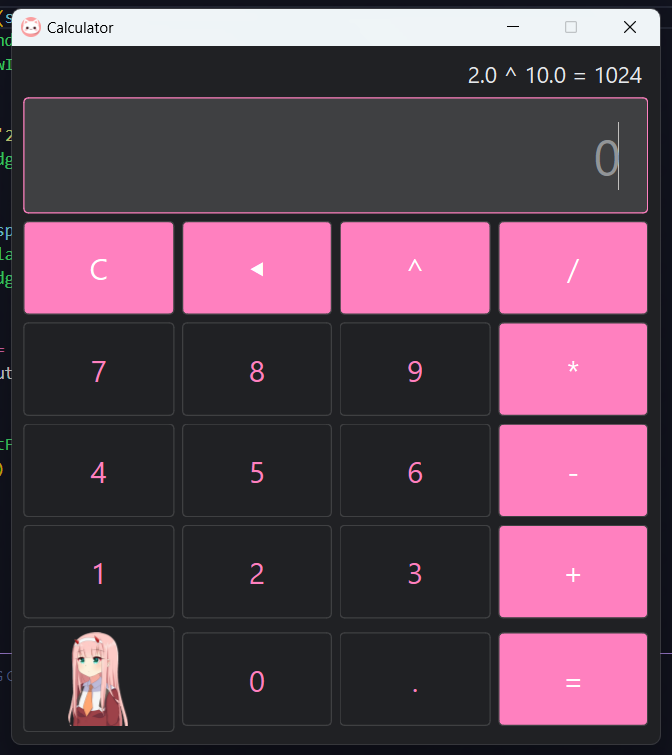

# python-basics
I created this repository as a personal archive for my Python learning files, making it easy to access and review them later. Feel free to explore and use any of the code snippets or projects you find helpful. 

<h2>GUI</h2>

- `calculator`: Creating a calculator from scratch using PySide6 - GUI with QT6

<h2>modules</h2>

🚧 under development 🚧

<!-- - `web_scraping`:
- `http_requests`:
- `managing_pdfs`:
- `sending_emails`:
- `system_arguments`:
- `external_commands`:
- `excel_spreadsheet`:
- `template_substitutor`:
- `environment_variables`: -->

<h2>Thank you very much!</h2>

